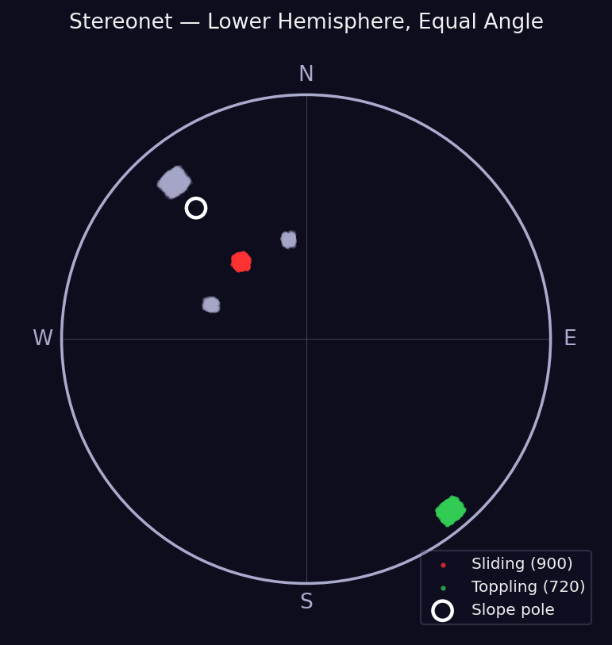
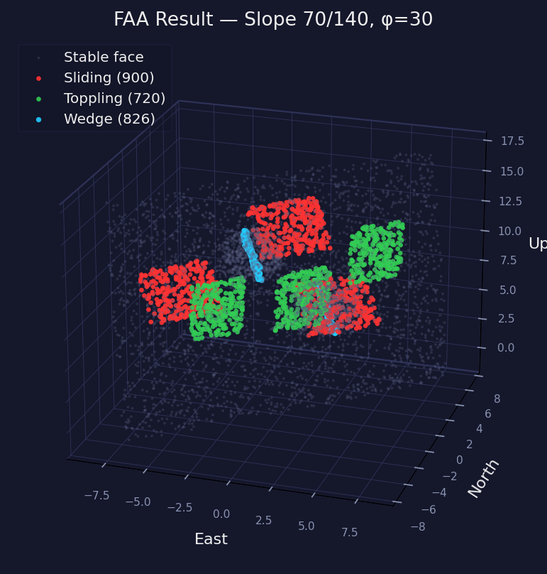

# FAA Rock Slope Kinematic Analysis

Desktop + web app implementing the **Extended Facet Amalgamation Approach (FAA)**  
from GEO Technical Note TN 4/2024 — K.K. Chan, CEDD, HKSAR Government.

---

## Desktop App (Windows / macOS / Linux)

### Windows — quickest start

1. Install **Python 3.11** from [python.org](https://www.python.org/downloads/)  
   *(tick "Add Python to PATH" during install)*
2. Download or clone this repository
3. Double-click **`run.bat`**

`run.bat` automatically creates a virtual environment, installs all dependencies on first run, then launches the app. Subsequent launches skip the install step and open immediately.

> **Python version note:** open3d requires Python 3.8–3.12. Python 3.13 is not yet supported.

### macOS / Linux

```bash
python3 -m venv .venv
source .venv/bin/activate
pip install -r requirements.txt
python faa_gui.py
```

### Supported input formats

| Type | Formats |
|------|---------|
| Mesh | PLY, OBJ, STL, FBX, OFF, GLTF, GLB |
| Point cloud | PLY, XYZ, XYZN, XYZRGB, PCD, PTS |
| LiDAR (GeoSLAM etc.) | **LAS, LAZ** |

### Workflow

1. Open a LiDAR scan or mesh file
2. Set slope orientation (dip / dip direction) — or click **Fit Plane from Data**
3. Set geotechnical parameters (friction angle, lateral limits, KNN)
4. Click **Sliding**, **Toppling**, **Wedge**, or **Run All**
5. Review coloured results in 3-D view and stereonet
6. Export result points as PLY or CSV

---

## Web App

Live at **[altezza938.github.io/dips](https://altezza938.github.io/dips)**

- Drag-and-drop LAS, PLY, OBJ, XYZ, XYZN, or PTS files
- No installation required
- LAZ is not supported in the browser — convert to LAS first (e.g. `las2las`)

---

## Example Results

Produced from the bundled sample (`sample_slope.xyzn`) with slope **70° / 140°**,
friction **30°**, lateral limits **20°**, min. angular difference **30°**, k = **16**.
Result: **900** sliding · **720** toppling · **826** wedge intersections.

### Stereonet (lower hemisphere, equal angle)



*Figure 1. Poles to discontinuities. Red poles satisfy the planar-sliding criteria,
green poles the flexural-toppling criteria; grey poles are stable. The white ring is
the pole to the slope face (70° / 140°).*

### 3-D view coloured by failure mode



*Figure 2. Planar sliding (red), flexural toppling (green) and wedge sliding (cyan)
over the stable rock face (grey). Axes in metres (x = East, y = North, z = Up).*

> Regenerate these figures with `python make_figures.py` (uses `faa_core.py` and
> the sample data; requires `numpy` and `matplotlib`).

---

## Dependencies

```
numpy>=1.24
scipy>=1.10
PyQt5>=5.15
matplotlib>=3.7
open3d>=0.17
laspy[lazrs]>=2.0
```

---

## Reference

Chan, K.K. (2024). *Digital Mapping and Kinematic Analysis of Rock Slopes by Extended Facet Amalgamation Approach (FAA)*. GEO Technical Note TN 4/2024, Planning and Development Division, Civil Engineering and Development Department, HKSAR Government.
